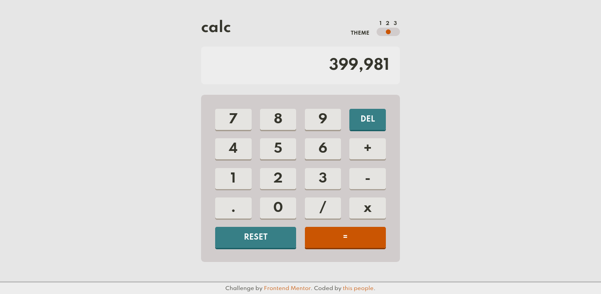

# Frontend Mentor - Calculator app solution

This is a solution to the [Calculator app challenge on Frontend
Mentor](https://www.frontendmentor.io/challenges/calculator-app-9lteq5N29).

## Table of contents

- [Overview](#overview)
  - [The challenge](#the-challenge)
  - [Screenshot](#screenshot)
  - [Links](#links)
- [My process](#my-process)
  - [Built with](#built-with)
  - [What I learned](#what-i-learned)
  - [Continued development](#continued-development)
  - [Useful resources](#useful-resources)
- [Author](#author)
- [Contributors](#contributors)

## Overview

### The challenge

Users should be able to:

- See the size of the elements adjust based on their device's screen size
- Perform mathmatical operations like addition, subtraction, multiplication, and
  division
- Adjust the color theme based on their preference
- **Bonus**: Have their initial theme preference checked using
  `prefers-color-scheme` and have any additional changes saved in the browser

### Screenshot

### Links

- [Github](https://github.com/halivert/calculator-app)
- [Live Site URL](https://halivert.dev/calculator-app)

## My process

I like to write first the HTML, only the HTML, it looks weird but when it's
done I have a better idea of the styles needed.

Then I try to use only CSS for everything (animations, states, styles) and the
last step is to add JS.

### Built with

- Semantic HTML5 markup
- CSS custom properties
- Flexbox
- Mobile-first workflow
- Vanilla JS

### What I learned

1. How to group numbers.
2. How to use media queries with JS.
3. How to format numbers (Intl.NumberFormat).
   (This isn't effective for this particular project.)

### Continued development

- [ ] Update layout for horizontal orientation in mobile.
- [ ] Add other mathematical functions.

### Useful resources

[JS Media queries][1]

## Author

- Website - [Hali](https://halivert.dev)
- Frontend Mentor - [@halivert](https://www.frontendmentor.io/profile/halivert)
- Twitter - [@halivert](https://www.twitter.com/halivert)

## [Contributors][2]

[1]: https://css-tricks.com/working-with-javascript-media-queries/
[2]: https://github.com/halivert/calculator-app/graphs/contributors
